## 🌐 **Bicycle E-commerce Website**  
> Nền tảng thương mại điện tử chuyên biệt dành cho việc mua bán xe đạp, tích hợp nhiều tiện ích và ưu đãi dành cho khách hàng.

🔗 [**Truy cập website**](https://huyvu.dev)

---

### 📝 **Giới thiệu dự án**  
Dự án xây dựng một website thương mại điện tử chuyên dụng dành cho lĩnh vực xe đạp, hỗ trợ người dùng dễ dàng **mua, bán, quản lý sản phẩm** và cập nhật các **tin tức thể thao** liên quan. Website hướng tới trải nghiệm mượt mà với **giao diện thân thiện**, **chức năng tối ưu**, đồng thời cung cấp các **ưu đãi linh hoạt** và hỗ trợ thanh toán tiện lợi.

---

### 🚀 **Công nghệ sử dụng**
- **Frontend**: React (Material UI), TypeScript, CSS  
- **Backend**: Spring Boot  
- **Database**: PostgreSQL, MongoDB  
- **Others**: Cloudinary (Lưu trữ hình ảnh)

---

### 🛠️ **Hướng dẫn cài đặt và chạy dự án**

#### **Yêu cầu hệ thống**
- **Docker** và **Docker Compose** (cho backend)
- **Node.js** và **npm** (cho frontend)
- **Git** để clone repository

#### **📦 Chạy Backend với Docker**

1. **Clone repository backend:**
   ```bash
   git clone https://github.com/HuyVu2379/Bicycle_E-commerce_BE.git
   cd Bicycle_E-commerce_BE
   ```

2. **Chạy toàn bộ hệ thống backend:**
   ```bash
   docker-compose up -d
   ```

3. **Kiểm tra trạng thái các services:**
   ```bash
   docker-compose ps
   ```

4. **Các services sẽ chạy trên các port sau:**
   - **Gateway Service**: http://localhost:8080
   - **Eureka Server**: http://localhost:8761
   - **User Service**: http://localhost:8085
   - **PostgreSQL**: localhost:5433
   - **Redis**: localhost:6380

5. **Dừng hệ thống:**
   ```bash
   docker-compose down
   ```

6. **Xóa toàn bộ (bao gồm volumes):**
   ```bash
   docker-compose down -v
   ```

#### **🎨 Chạy Frontend**

1. **Clone repository frontend:**
   ```bash
   git clone https://github.com/HuyVu2379/Bicycle_E-commerce_FE.git
   cd Bicycle_E-commerce_FE
   ```

2. **Cài đặt dependencies:**
   ```bash
   npm install
   ```

3. **Chạy ứng dụng frontend:**
   ```bash
   npm run dev
   ```

4. **Truy cập ứng dụng:**
   - Frontend sẽ chạy trên: http://localhost:3000 (hoặc port được hiển thị trong terminal)

#### **🔧 Lưu ý quan trọng**
- Đảm bảo chạy **backend trước** rồi mới chạy **frontend**
- Kiểm tra file `.env` trong frontend để cấu hình đúng API endpoint
- Backend sẽ tự động tạo database và tables khi khởi động lần đầu
- Nếu gặp lỗi port conflict, có thể thay đổi port trong `docker-compose.yml`

#### **📋 Troubleshooting**
- Nếu Docker build bị lỗi, thử: `docker-compose build --no-cache`
- Nếu database lỗi, thử: `docker-compose down -v` rồi `docker-compose up -d`
- Kiểm tra logs: `docker-compose logs <service-name>`

---

### ✨ **Chức năng nổi bật**

#### 👤 **Khách hàng**
- Đăng ký/đăng nhập (bao gồm Google OAuth)
- Cập nhật thông tin cá nhân, chọn địa chỉ trên bản đồ
- Tìm kiếm, lọc sản phẩm theo nhiều tiêu chí
- Thanh toán bằng VNPay, áp dụng mã giảm giá
- Đọc bài viết về xe đạp & xem đánh giá sản phẩm
- Nhận email xác nhận khi đặt hàng

#### 🛍️ **Nhà cung cấp**
- Quản lý tài khoản và thông tin sản phẩm
- Theo dõi đơn hàng và đăng sản phẩm mới
- Xem thống kê sản phẩm bán chạy theo bộ lọc

#### 🛠️ **Quản trị viên**
- Quản lý và phân quyền người dùng
- Duyệt sản phẩm, quản lý đơn hàng, đánh giá
- Thiết lập và quản lý chương trình khuyến mãi

---

### 📸 **Demo giao diện**

#### 👥 Người dùng
- **Màn hình đăng nhập**  
  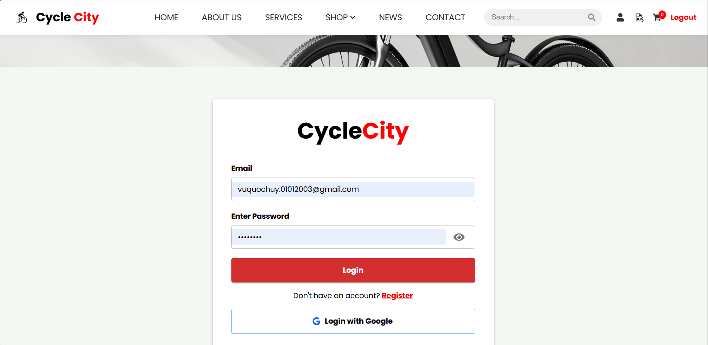

- **Màn hình chính (Trang chủ)**  
  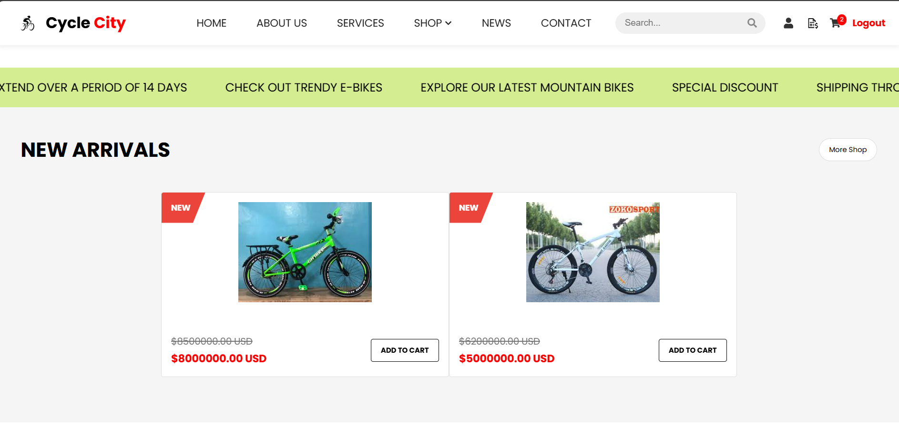

- **Thông tin cá nhân**  
  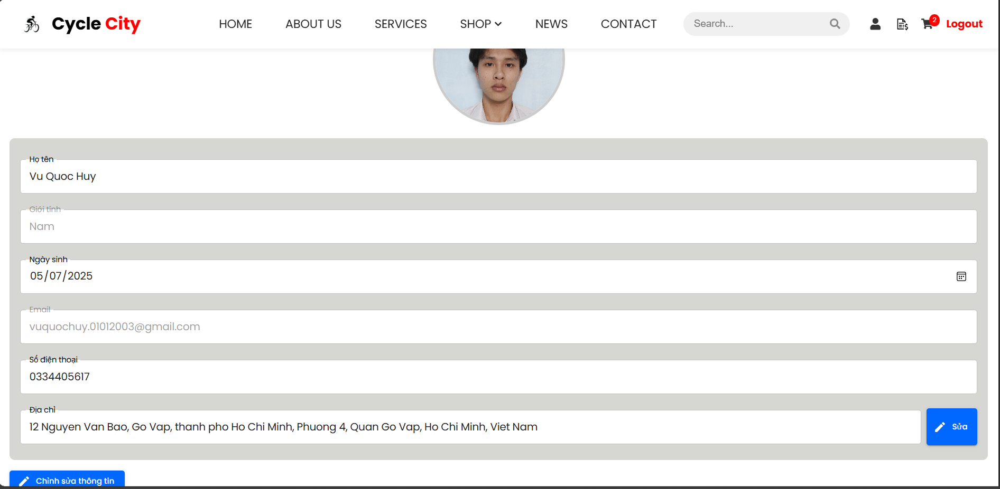

- **Lịch sử mua hàng**  
  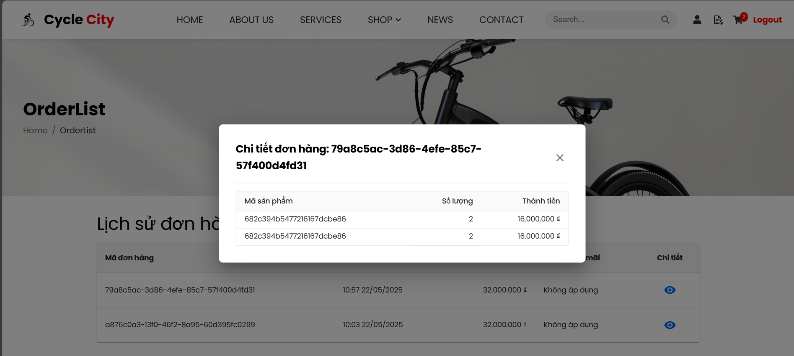

- **Giỏ hàng**  
  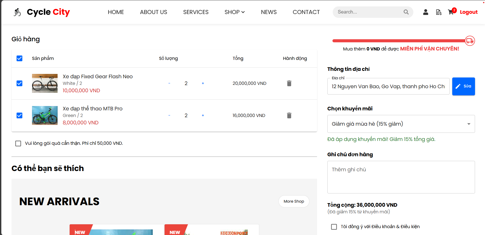

- **Thanh toán với VNPay**  
  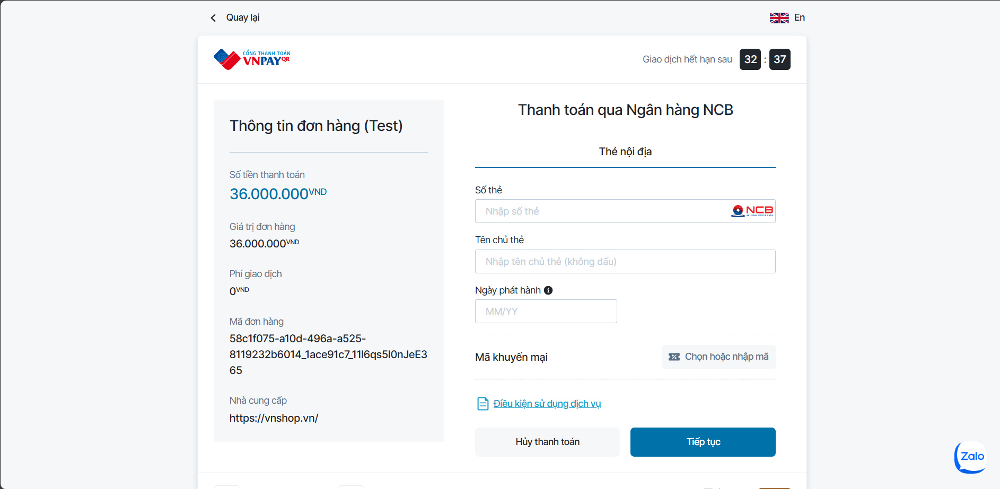

- **Email xác nhận đơn hàng**  
  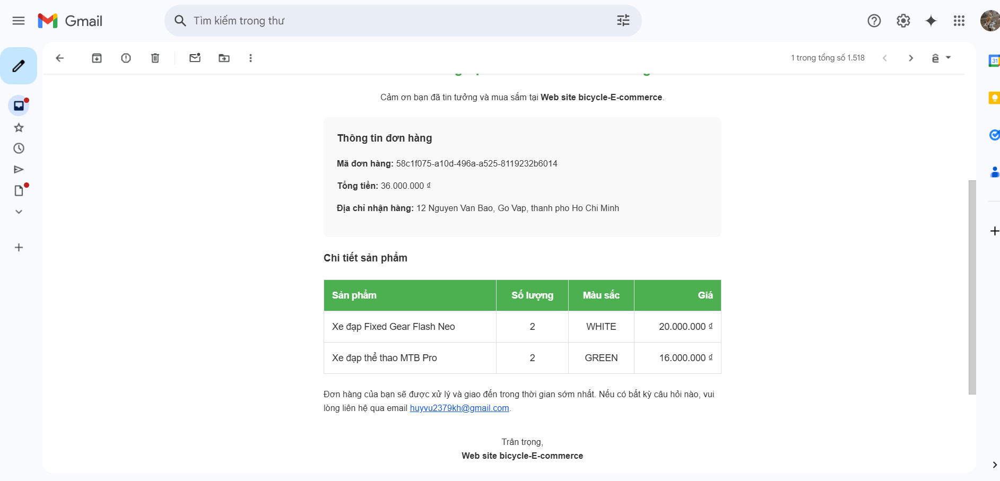

#### 🏪 Nhà cung cấp & Quản trị viên
- **Trang sản phẩm**  
  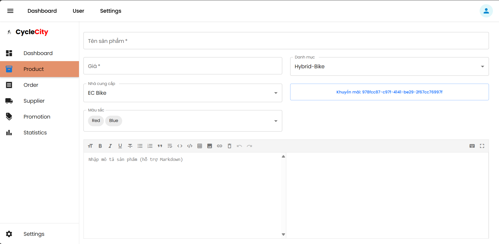  
  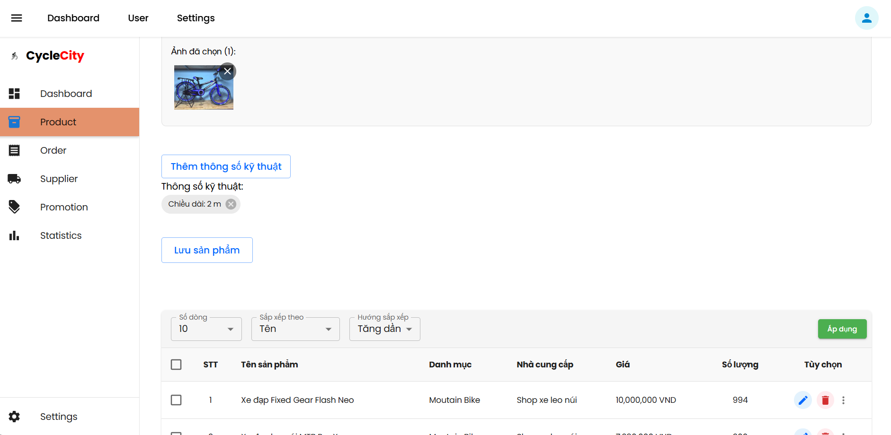

- **Quản lý đơn hàng**  
  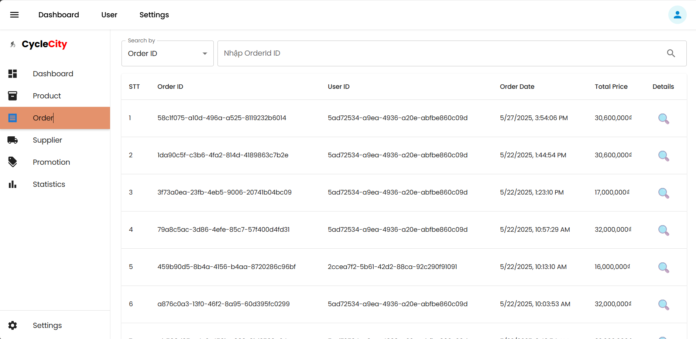

- **Trang khuyến mãi**  
  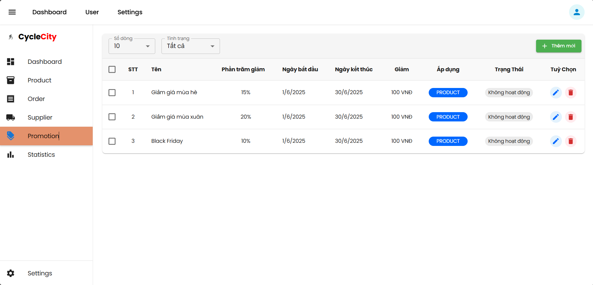

---

### 📌 **Trạng thái dự án**  
🔧 Đang phát triển và bảo trì liên tục

---

> 🌟 *Hãy ghé qua website để trải nghiệm thực tế! Mọi phản hồi từ bạn sẽ là động lực để mình cải thiện tốt hơn.*
